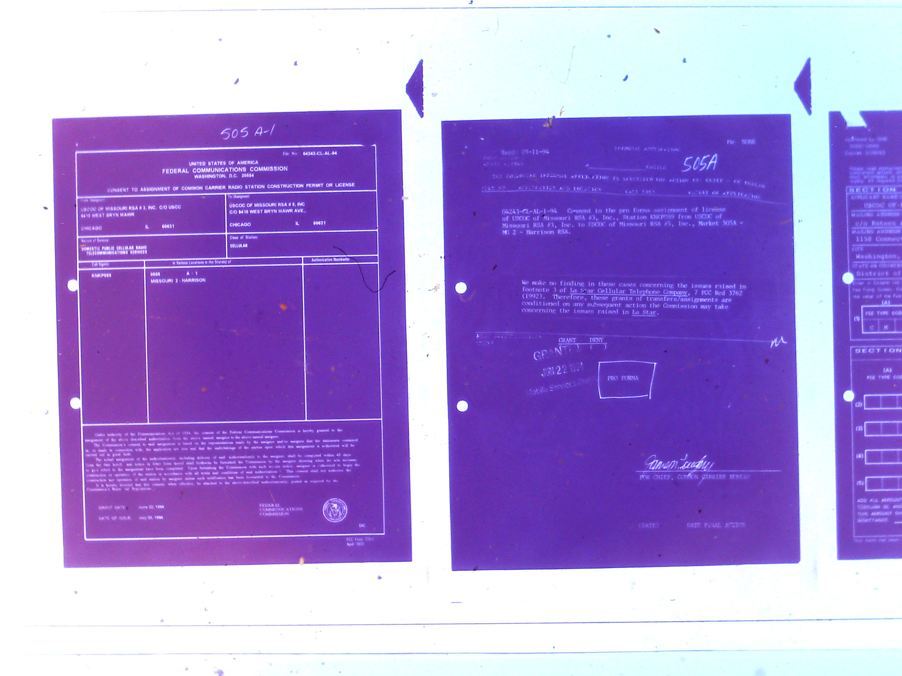

# From Microfiche to Dataset?

This is an attempt to document the triumphs and frustrations of wrangling a dataset from [Federal Communication Commission](https://www.fcc.gov/) microfiche (dead tree captured on small film) archives. Here's an example:

**TASK**: Take 32GB (and counting) of scanned microfiche documents (.jpg images), and extract dates, involved parties, and transaction details for every mobile spectrum license sale or transfer contained in these images.

**PURPOSE**: The transactions extracted from the microfiche will form part of a larger chronology of mobile spectrum licence trading up to the present day. This history is of particular interest in reflecting on Ronald Coase's seminal paper from 1959 [The Federal Communications Commission](http://www.jstor.org/stable/724927), and to examine the allocative efficiency of auctions and lotteries.

## [The Journey so Far](journal.md)

A journal of things I've thought/did/learnt, and problems/issues/complaints I've had, in chronological-ish order.   

## Process Snippets

Scripts, tools and code snippets for future reference:

- [file management, image preprocessing in bash](transformations.ipynb)
- [extracting lists of images based meta-tags for encoding](https://github.com/cynthiahqy/dataset-fcc/tree/master/processes/list-extractions)
- [optical character recognition using Tesseract, and attempts to improve image quality]
- [scraping FCC's Universal Licensing System using Selenium and BeautifulSoup in python](https://github.com/cynthiahqy/uls-scraping)

## [Lessons for future data wrangling](learnings.md)

A summary of things that I wish I'd known before trying to wrangle a dataset from the wild. The TL;DR version of my journal. 
